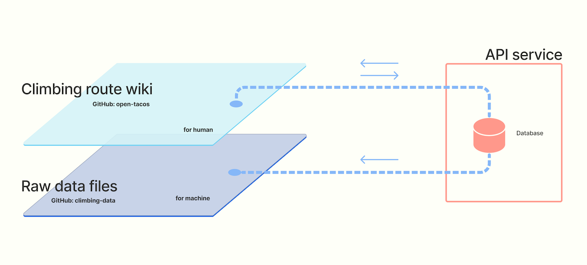

# Technical overview

We publish climbing content ("data") in two forms, *human-readable* and *machine-readable*.  Having two representations of the same data enables us to address multiple community needs.  

**Benefit of a searchable catalog of climbing information:**

We're hoping by creating a useful and easy-to-use "search engine" that provides value to our users, we can build a community of editors that will help us identify inaccuracies and improve the underlying data.

**Benefits of machine-readabe climbing data:**
- Allow independent developers to build on and enrich the existing ecosystem.  
- Provide data science students with much needed datasets. 
- Increase the efficiency of public research related to climbing.

### Climbing route wiki 

Inspired by Wikipedia and OpenStreetMap, the web application (code name OpenTacos) provides the climbing community with a searchable catalog of climbing routes.

- Work-in-progress: Crag finder.
- Planned feature: Collaborative editing.

> Live site: https://tacos.openbeta.io  
> Source code: https://github.com/openbeta/open-tacos

### Climbing data

Climbing datasets in CSV, jsonlines, and Python pickle format.

> Source code: https://github.com/openbeta/climbing-data

### API service

A GraphQL-based API that provides data for OpenTacos.  We plan to open the API to public at some point in 2022.  Be sure to [subscribe to the newsletter](/stay-connected).

> Source code: https://github.com/openbeta/openbeta-graphql
